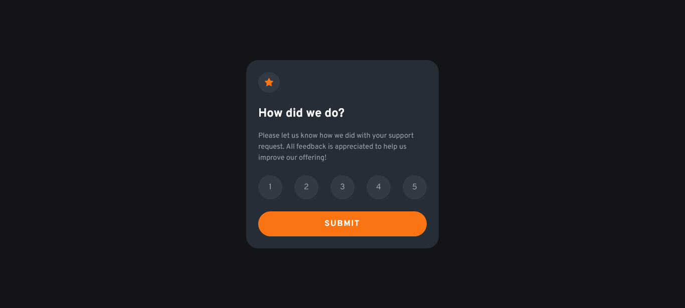

# Frontend Mentor - Interactive rating component solution

This is a solution to the [Interactive rating component challenge on Frontend Mentor](https://www.frontendmentor.io/challenges/interactive-rating-component-koxpeBUmI). 

## Table of contents

- [Overview](#overview)
  - [The challenge](#the-challenge)
  - [Screenshot](#screenshot)
  - [Links](#links)
- [My process](#my-process)
  - [Built with](#built-with)
  - [What I learned](#what-i-learned)
  - [Continued development](#continued-development)
  - [Useful resources](#useful-resources)
- [Author](#author)
- [Acknowledgments](#acknowledgments)

## Overview

### The challenge

Users should be able to:

- View the optimal layout for the app depending on their device's screen size
- See hover states for all interactive elements on the page
- Select and submit a number rating
- See the "Thank you" card state after submitting a rating

### Screenshot

- Feedback component


- Feedback component when in active and focus states


- Thank you modal


### Links

- Solution URL: [Solution](https://www.frontendmentor.io/solutions/responsive-interactive-and-accessible-rating-component-using-css-grid-2yZs0Ct44e)
- Live Site URL: [Live Site](https://fejiro001.github.io/interactive-rating-component-main/)

## My process

### Built with

- Semantic HTML5 markup
- SASS
- CSS custom properties
- Flexbox
- CSS Grid
- Mobile-first workflow

### What I learned

Used event delegation which helped me handle events more efficiently for multiple elements:
```js
numberRating.addEventListener("click", (event) => {
    if (event.target.tagName === "BUTTON") {
        userFeedback.innerHTML = event.target.innerHTML;
    }
});
```

Created an event listener for when the modal is exited by targeting the main body when clicked:
```js
main.addEventListener('click', (event) => {
    if (event.target === main) {
        thankYouModal.style.display = 'none';
    }
});
```
### Continued development

I want to expand more on event handling and best practices.

### Useful resources

- ChatGPT really helped me understand event delegation

## Author

- Website - [Add your name here](https://www.your-site.com)
- Frontend Mentor - [@Fejiro001](https://www.frontendmentor.io/profile/Fejiro001)
- Twitter - [@aberefejiro](https://twitter.com/aberefejiro)

## Acknowledgments

- Adrian's post on Twitter helped me know about event delegation, so a big shout-out to him - [@wydmanski_](https://twitter.com/wydmanski_)
